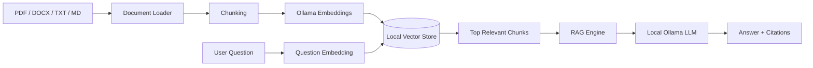

<div align="center">

# 🧠 NexaRAG — Local AI Research Copilot

### Private • Citation-Grounded • RAG-Powered • Runs Locally


**Upload PDF, DOCX, TXT or Markdown files → ask questions → get answers grounded in your documents with source citations.**

</div>

---

## 🚀 What this project does

NexaRAG is a local Retrieval-Augmented Generation system. It converts your documents into embeddings, finds the most relevant information for a question, and gives that evidence to a local LLM before generating the answer.

### Features

- 📄 PDF, DOCX, TXT and Markdown ingestion
- 🧩 Overlapping document chunking
- 🔢 Local embeddings using Ollama
- 🔎 Cosine-similarity semantic search
- 🧠 Local LLM generation
- 📚 Source-grounded answers with citations
- 💬 Streamlit chat application
- ⚡ FastAPI REST API
- 💾 Persistent local vector index
- 🔐 No paid AI API key required by default
- 🐳 Docker support
- ✅ GitHub Actions CI
- 🧪 Unit tests

---

## 🏗️ Architecture



---

## 📁 Professional Project Structure

```text
NexaRAG-AI-Research-Copilot/
│
├── apps/
│   ├── streamlit_app.py          # Streamlit web interface
│   └── api.py                    # FastAPI REST API
│
├── nexarag/                      # Core AI package
│   ├── __init__.py
│   ├── config.py                 # Application settings
│   │
│   ├── ingestion/
│   │   ├── __init__.py
│   │   ├── chunker.py            # Text chunking
│   │   └── document_loader.py    # PDF/DOCX/TXT/MD loading
│   │
│   ├── llm/
│   │   ├── __init__.py
│   │   └── ollama_client.py      # Chat + embedding requests
│   │
│   ├── retrieval/
│   │   ├── __init__.py
│   │   └── vector_store.py       # Vector storage and search
│   │
│   └── rag/
│       ├── __init__.py
│       └── engine.py             # Complete RAG pipeline
│
├── config/
│   └── .env.example             # Environment variable template
│
├── deploy/
│   ├── Dockerfile
│   └── docker-compose.yml
│
├── examples/
│   └── ai_notes.md              # Sample knowledge document
│
├── tests/
│   └── test_chunker.py
│
├── data/                         # Local vector index data
├── .github/workflows/
│   └── ci.yml                   # Automated testing
│
├── requirements.txt
├── .gitignore
├── LICENSE
└── README.md
```

This layout keeps the **UI**, **API**, **AI engine**, **retrieval layer**, **deployment**, **configuration**, and **tests** separate so the project can scale cleanly.

---

## 🧰 Tech Stack

| Part | Technology |
|---|---|
| Language | Python |
| Web UI | Streamlit |
| REST API | FastAPI |
| Local AI runtime | Ollama |
| Chat model | `qwen3:4b` by default |
| Embedding model | `embeddinggemma` by default |
| Retrieval | Cosine similarity |
| Vector storage | NumPy + JSON |
| PDF parsing | pypdf |
| DOCX parsing | python-docx |
| Testing | pytest |
| CI | GitHub Actions |
| Container | Docker |

---

# ⚙️ Installation

## 1. Clone the repository

```bash
git clone https://github.com/ayansayyad7000-png/NexaRAG-AI-Research-Copilot.git
cd NexaRAG-AI-Research-Copilot
```

## 2. Create a virtual environment

### Windows

```powershell
python -m venv .venv
.venv\Scripts\activate
```

### Ubuntu / Linux

```bash
python3 -m venv .venv
source .venv/bin/activate
```

## 3. Install dependencies

```bash
pip install -r requirements.txt
```

## 4. Install and start Ollama

Check Ollama:

```bash
ollama --version
```

Download the models:

```bash
ollama pull qwen3:4b
ollama pull embeddinggemma
```

## 5. Create environment configuration

### Windows

```powershell
copy config\.env.example .env
```

### Linux

```bash
cp config/.env.example .env
```

Default configuration:

```env
OLLAMA_BASE_URL=http://localhost:11434
CHAT_MODEL=qwen3:4b
EMBED_MODEL=embeddinggemma
TOP_K=5
CHUNK_SIZE=180
CHUNK_OVERLAP=35
DATA_DIR=data
```

---

# 🖥️ Run the Streamlit application

From the repository root:

```bash
streamlit run apps/streamlit_app.py
```

Open:

```text
http://localhost:8501
```

Then:

1. Upload documents.
2. Click **Build Knowledge Base**.
3. Ask a question.
4. Read the generated answer.
5. Expand **Sources** to inspect the evidence.

---

# ⚡ Run the FastAPI backend

```bash
uvicorn apps.api:app --reload
```

API documentation:

```text
http://127.0.0.1:8000/docs
```

Health check:

```bash
curl http://127.0.0.1:8000/health
```

---

# 🐳 Docker

Build the image:

```bash
docker build -f deploy/Dockerfile -t nexarag .
```

Or start with Docker Compose:

```bash
docker compose -f deploy/docker-compose.yml up --build
```

Ollama should already be running on the host computer.

---

## 🧠 RAG Pipeline

```text
Document
   ↓
Document Loader
   ↓
Chunker
   ↓
Embedding Model
   ↓
Local Vector Store
   ↓
Semantic Retrieval
   ↓
Relevant Context
   ↓
Local LLM
   ↓
Grounded Answer + Citations
```

The LLM is instructed to answer only from retrieved context and to say when the indexed documents do not contain enough information.

---

## 🧪 Tests

Run:

```bash
python -m pytest -q
```

The repository includes tests for chunk creation, overlap behavior, and invalid chunk configuration.

---

## ✅ Continuous Integration

GitHub Actions runs automatically on pushes and pull requests to `main`.

```text
Checkout
   ↓
Install Python
   ↓
Install dependencies
   ↓
Compile Python files
   ↓
Run pytest
```

Workflow file:

```text
.github/workflows/ci.yml
```

---

## 🔐 Privacy

The default architecture uses local Ollama models. The application does not require sending your documents to a paid cloud LLM API.

Local index files are stored under `data/` and are excluded from normal Git commits.

---

## 💡 Interview Explanation

> I built a modular local Retrieval-Augmented Generation system. The ingestion layer loads and chunks documents, Ollama creates embeddings, a local vector store retrieves the most relevant chunks using cosine similarity, and the RAG engine sends only that evidence to a local LLM. I exposed the system through Streamlit and FastAPI, added source citations, persistent storage, Docker deployment, tests, and GitHub Actions CI.

---

## 🔥 Future Improvements

- Hybrid BM25 + vector retrieval
- Cross-encoder reranking
- OCR for scanned PDFs
- Multimodal document understanding
- Conversation memory
- Agentic web research
- PostgreSQL + pgvector
- Redis caching
- Authentication
- AWS deployment
- RAG evaluation metrics

---

<div align="center">

## 👨‍💻 Author

**Ayan Sayyad**  
B.Tech Information Technology  
Cloud • DevOps • Python • Linux • AI Engineering

### Build AI systems that can explain where their answers came from.

</div>
