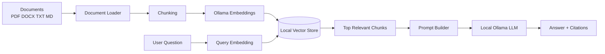

<div align="center">

# 🧠 NexaRAG — Local AI Research Copilot

### Private • Citation-Grounded • RAG-Powered • Runs Locally


**Upload PDFs, DOCX, TXT or Markdown → ask questions → get grounded answers with sources.**

</div>

---

## 🚀 Why this project is strong

NexaRAG is not a basic chatbot. It builds a searchable knowledge base from your own documents and uses a local LLM to answer only from retrieved evidence.

### Main features

- 📄 Upload **PDF, DOCX, TXT and Markdown**
- 🧩 Automatic document chunking
- 🔢 Local embeddings through **Ollama**
- 🔎 Semantic vector search using NumPy
- 🧠 Local LLM generation
- 📚 Source-grounded answers with citation numbers
- 💬 Streamlit chat interface
- ⚡ FastAPI REST API
- 💾 Persistent local vector index
- 🔐 No paid AI API key required
- 🐳 Docker support
- ✅ GitHub Actions CI
- 🧪 Unit tests

---

## 🏗️ Architecture



---

## 🧰 Tech Stack

| Layer | Technology |
|---|---|
| Language | Python |
| UI | Streamlit |
| API | FastAPI |
| LLM runtime | Ollama |
| Chat model | `qwen3:4b` by default |
| Embeddings | `embeddinggemma` by default |
| Retrieval | Cosine similarity |
| Vector storage | NumPy + JSON |
| PDF parsing | pypdf |
| DOCX parsing | python-docx |
| Testing | pytest |
| CI | GitHub Actions |
| Container | Docker |

---

## 📁 Project Structure

```text
NexaRAG-AI-Research-Copilot/
├── app.py
├── api.py
├── requirements.txt
├── .env.example
├── .gitignore
├── Dockerfile
├── docker-compose.yml
├── LICENSE
├── src/
│   ├── __init__.py
│   ├── chunker.py
│   ├── config.py
│   ├── document_loader.py
│   ├── ollama_client.py
│   ├── rag.py
│   └── vector_store.py
├── tests/
│   └── test_chunker.py
├── sample_docs/
│   └── ai_notes.md
└── .github/
    └── workflows/
        └── ci.yml
```

---

# ⚙️ Setup

## 1. Install Python

Use Python 3.11 or newer.

Check:

```bash
python --version
```

On Ubuntu:

```bash
python3 --version
```

---

## 2. Install Ollama

Install Ollama from its official website.

After installation, check:

```bash
ollama --version
```

---

## 3. Download the AI models

Chat model:

```bash
ollama pull qwen3:4b
```

Embedding model:

```bash
ollama pull embeddinggemma
```

Test the chat model:

```bash
ollama run qwen3:4b
```

---

## 4. Clone this repository

```bash
git clone https://github.com/ayansayyad7000-png/NexaRAG-AI-Research-Copilot.git
cd NexaRAG-AI-Research-Copilot
```

---

## 5. Create a virtual environment

### Windows

```powershell
python -m venv .venv
.venv\Scripts\activate
```

### Ubuntu/Linux

```bash
python3 -m venv .venv
source .venv/bin/activate
```

---

## 6. Install packages

```bash
pip install -r requirements.txt
```

---

## 7. Create environment file

Windows:

```powershell
copy .env.example .env
```

Linux:

```bash
cp .env.example .env
```

Default configuration:

```env
OLLAMA_BASE_URL=http://localhost:11434
CHAT_MODEL=qwen3:4b
EMBED_MODEL=embeddinggemma
TOP_K=5
CHUNK_SIZE=180
CHUNK_OVERLAP=35
```

---

# 🖥️ Run the Streamlit App

```bash
streamlit run app.py
```

Open `http://localhost:8501`.

### How to use

1. Upload one or more documents.
2. Click **Build Knowledge Base**.
3. Wait until indexing finishes.
4. Ask a question.
5. Read the answer.
6. Expand **Sources** to inspect the retrieved evidence.

---

# ⚡ Run the FastAPI Backend

```bash
uvicorn api:app --reload
```

Open API docs at `http://127.0.0.1:8000/docs`.

## API Health Check

```bash
curl http://127.0.0.1:8000/health
```

## Ask a Question Through API

```bash
curl -X POST http://127.0.0.1:8000/ask \
  -H "Content-Type: application/json" \
  -d "{\"question\":\"What are the main ideas in my documents?\"}"
```

---

# 🐳 Docker

```bash
docker compose up --build
```

Ollama must already be running on your host computer.

---

# 🧠 How RAG Works Here

1. **Load documents** — reads PDF, DOCX, TXT and Markdown.
2. **Chunk text** — divides long content into overlapping sections.
3. **Create embeddings** — converts chunks into numeric vectors.
4. **Store vectors** — saves vectors and metadata locally.
5. **Search** — embeds the user's question.
6. **Retrieve** — cosine similarity finds the best evidence.
7. **Generate** — sends only retrieved context to the local LLM.
8. **Cite** — answer references evidence with `[1]`, `[2]`, etc.

---

# 🔐 Privacy

The default design uses local Ollama models. Documents and the vector index remain on your machine unless you separately upload or sync them elsewhere.

---

# 🧪 Run Tests

```bash
pytest -q
```

---

# ✅ GitHub Actions

Every push performs a Python syntax check and runs the unit tests through `.github/workflows/ci.yml`.

---

# 💡 Interview Explanation

> I built a local Retrieval-Augmented Generation system. It ingests documents, splits them into semantic chunks, creates embeddings through Ollama, stores the vectors locally, retrieves the most relevant context using cosine similarity, and sends only that evidence to a local LLM. I exposed it through both Streamlit and FastAPI and added source citations, persistence, Docker support, tests and CI.

---

# 🔥 Future Improvements

- Hybrid BM25 + vector search
- Cross-encoder reranking
- Web search agent
- Conversation memory
- OCR for scanned PDFs
- Image understanding
- PostgreSQL/pgvector
- Redis cache
- AWS deployment
- Agentic research workflow
- RAG evaluation metrics

---

# 👨‍💻 Author

**Ayan Sayyad**  
B.Tech Information Technology  
Cloud • DevOps • Python • Linux • AI Engineering

<div align="center">

### Build systems that can explain where their answers came from.

</div>
